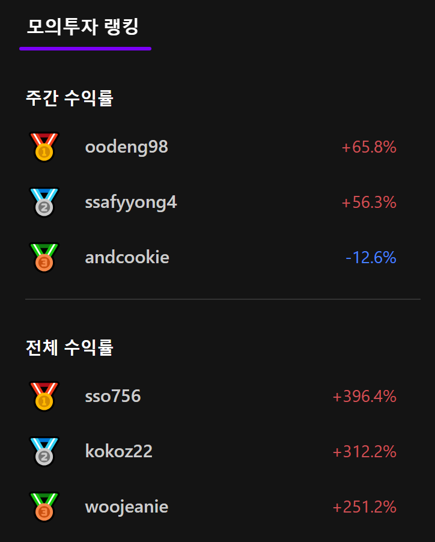
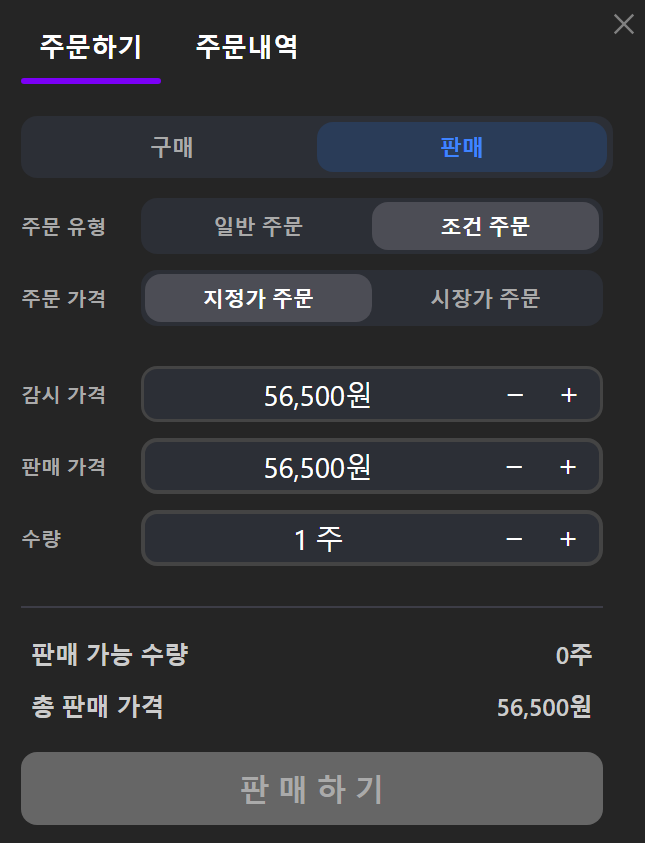

## 📈 모두모투
모두를 위한 모의투자

WTS 모의투자 플랫폼

🌳 프로젝트 개요
---
기간
* 2024.10.23 - 2024.11.19 (4주) 🔥

구성원
  * 백엔드 1명
  * 프론트엔드 4명

### 👍 서비스 소개
---
✔️ 코로나 이후 신규 투자자가 대거 유입되었으며, 투자자 유형이 다변화되었습니다.   최근 MTS/HTS를 넘어선 WTS 수요 증가에 대응하여, 투자 경험을 제공하는 웹 기반 모의투자 플랫폼입니다.

✔️ AI 챗봇 기능을 활용하여, 초보자도 안전하게 투자 연습을 하면서
쉽게 실전 대비 훈련을 할 수 있는 모의투자 플랫폼입니다.

✔️ 이를 통해 사용자들은 가상의 돈을 이용하여 실시간 종목 조회 및 투자 시뮬레이션을 경험할 수 있습니다.

### 👍 특징 및 차별점
---
✔️ 독창성
* 시중에 없는 WTS용 모의투자 서비스 (2024년 11월 기준)

✔️ 접근성
* 웹에서 바로 투자 연습 가능

✔️ 실시간 데이터
* 한국투자증권 API로 실시간 주식 데이터 제공

✔️ 초보자 친화적
* 쉽고 직관적인 UI/UX로 누구나 쉽게 투자 경험 가능

### 🔨 주요 기술 스택
---
✔️ Frontend
* React
* TypeScript

✔️ Backend
* Django

✔️ DB
* MySQL
* Redis

✔️ Deploy
* AWS EC2
* Docker
* Docker-compose
* Nginx
* Jenkins

✔️ Communication
* 형상 관리 - Gitlab
* 이슈 및 스크럼 관리 - Jira
* Notion
* Mattermost
* Figma

# 📚 목차

1️⃣ 타겟층

2️⃣ 주요 기능

3️⃣ 모두모투 서비스

4️⃣ 실행방법

5️⃣ 팀 구성

6️⃣ 기술 아키텍쳐

7️⃣ ERD 다이어그램

8️⃣ API 명세서

### 😮 타겟층
---
✔ 주식시장에 대한 기본적인 이해와 경험이 부족한 초보 투자자인 전 연령층

✔ 게임을 통해 쉽고 재미있게 주식투자에 대한 기본 개념을 배우고 싶은 학생 및 초보 투자자들

### 👍 주요 기능
---
1. 사용자 계정 관리
* 로그인/회원가입
* 개인 투자 기록 저장 및 관리

2. 종목 검색 및 조회
* 실시간 주가 데이터 조회
* 종목별 차트 분석 기능 제공

3. 모의 투자
* 가상 자금으로 매수/매도
* 투자 시뮬레이션 환경 제공
* 투자 성과 분석
* 수익률 대시보드

4. 커뮤니티 기능 (선택사항)
유저 랭킹 시스템

## 🌍 모두모투 서비스
---
### 메인페이지
📌 거시경제 지표

국내
* 코스피
* 코스닥

해외
* 다우존스
* 나스닥

환율
* 원/달러
* 엔/달러

원자재
* WTI
* 금

📌 보유종목 / 주문내역 / 관심종목

📌 모의투자 랭킹

📌 종목 랭킹
항목별 랭킹
* 거래대금
* 거래량
* 급상승
* 급하락

### 위젯 페이지
📌 위젯 커스터마이징

📌 심볼

📌 차트

📌 기업정보 / 뉴스

📌 거래원 / 거래동향 /투자자

📌 호가

📌 시세

📌 주문하기 / 주문내역

### 부가기능
📌 AI 챗봇

📌 지수 Rolling

📌 종목 검색

💾 실행방법
🔗 주요 라이브러리 및 패키지 설치
npm install
🔗로컬 서버 시작
npm run dev

### 향후 개발 계획
정식 서비스 출시

로보 어드바이저
* AI 기반 투자 종목 추천 시스템 도입

히트맵

미장까지 확장

👬 팀 구성

⚙ 기술 아키텍쳐

💎 ERD 다이어그램

📘 API 명세서

🍏와이어프레임

영상 포트폴리오
https://www.youtube.com/watch?v=-IW3y00URdY
